# Personal Blog

A personal blog built for the [roadmap.sh Personal Blog](https://roadmap.sh/projects/personal-blog) project: a server-rendered Spring Boot app that stores each article as a Markdown file and puts the admin section behind a login form.

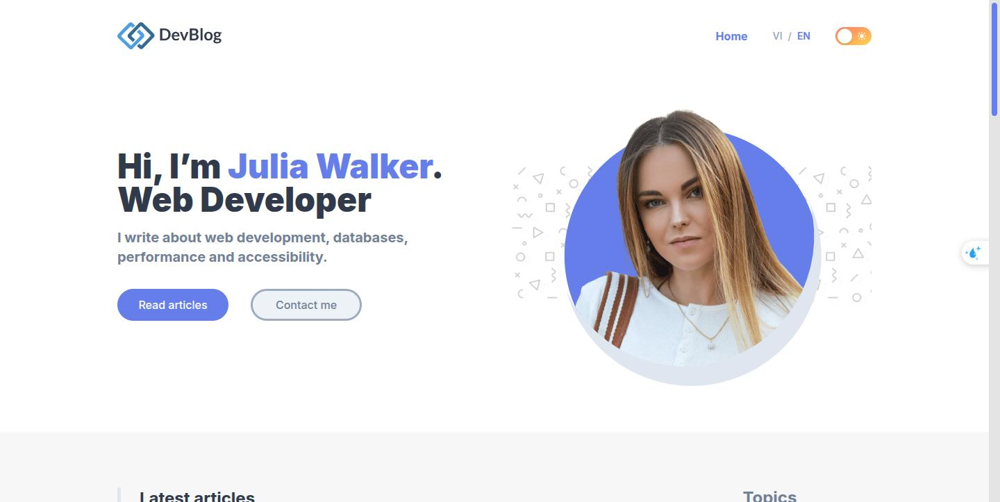

## At a glance

* **Guest section**: a home page with the latest published articles, category and tag filters, pagination, and an article page that renders Markdown.
* **Admin section** behind a form login: a dashboard of every article (draft, scheduled, published), Add / Edit forms, and a delete confirmation page.
* **No database**: one Markdown file with YAML front matter per article.
* **No JavaScript required**: every flow (read, log in, add, edit, delete) is a plain HTML form or link. JavaScript only adds the dark mode toggle and the mobile menu.
* **English / Vietnamese** interface, **light / dark** themes, and a responsive layout from phone to desktop.

## Screenshots

All screenshots were taken from a local run against the demo data in `demo/articles/`. They are stored in [`docs/screenshots/`](docs/screenshots).

### Guest section

#### Home


The home page opens with a hero section: a greeting with the author's name and role (`SITE_AUTHOR`, `SITE_AUTHOR_ROLE`), a tagline, a **Read articles** button that jumps to the list, a **Contact me** button, and the portrait (`SITE_HERO_IMAGE`). The header has the logo, the navigation, the **VI / EN** language switch and the theme toggle.

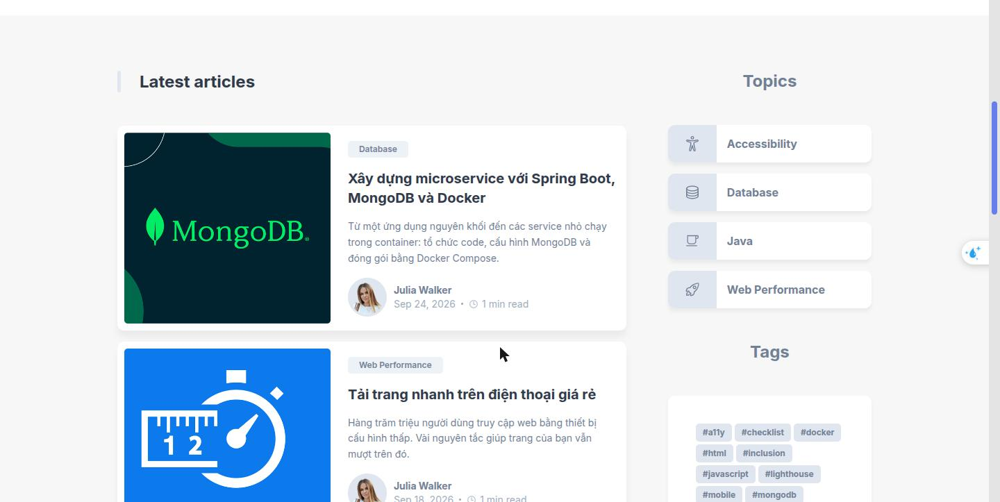

Below the hero, **Latest articles** lists published articles, newest first. Each card shows:

* the cover image
* a topic chip (the category)
* the title
* an excerpt (the summary, or the start of the content when there is no summary)
* the author, the publication date and an estimated reading time

The sidebar lists every **Topic** that has at least one published article, with a stable icon for each topic, and a **Tags** cloud.

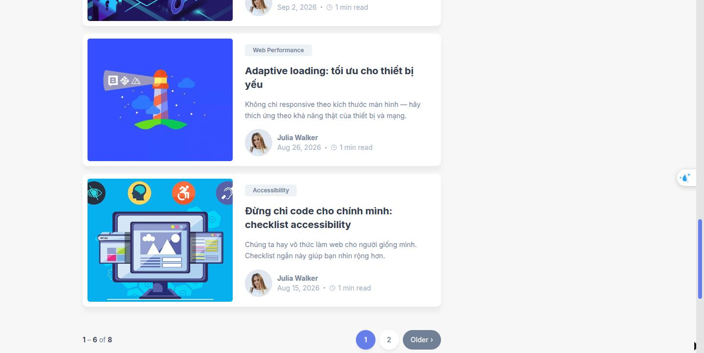

The home page shows 6 articles per page. The pager shows the range ("1 – 6 of 8"), page numbers, and Newer / Older links. Only published articles are counted: the demo has 10 files, but the draft and the scheduled article are hidden from guests.

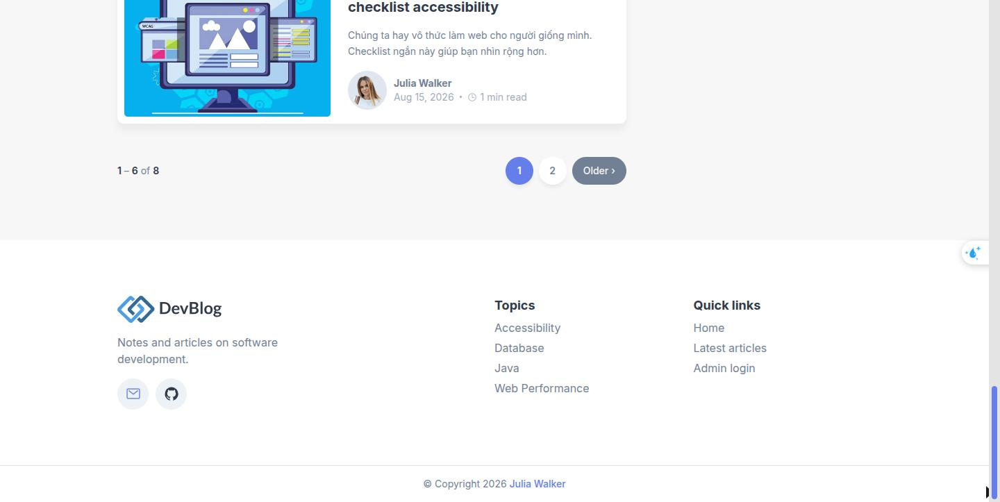

The footer has three columns:

* the site name and description with contact links (e-mail, GitHub, Facebook, LinkedIn, X; blank values are hidden)
* the topics
* quick links, including **Admin login**

#### Category and tag filters

| Category | Tag |
|---|---|
| 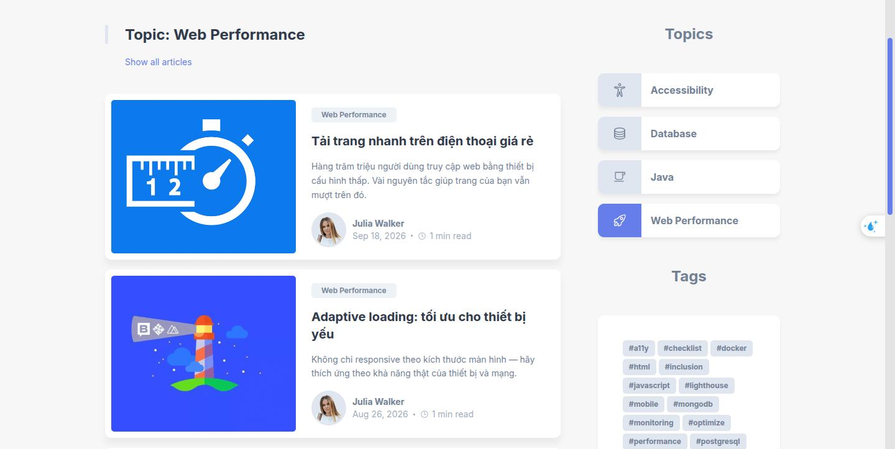 | 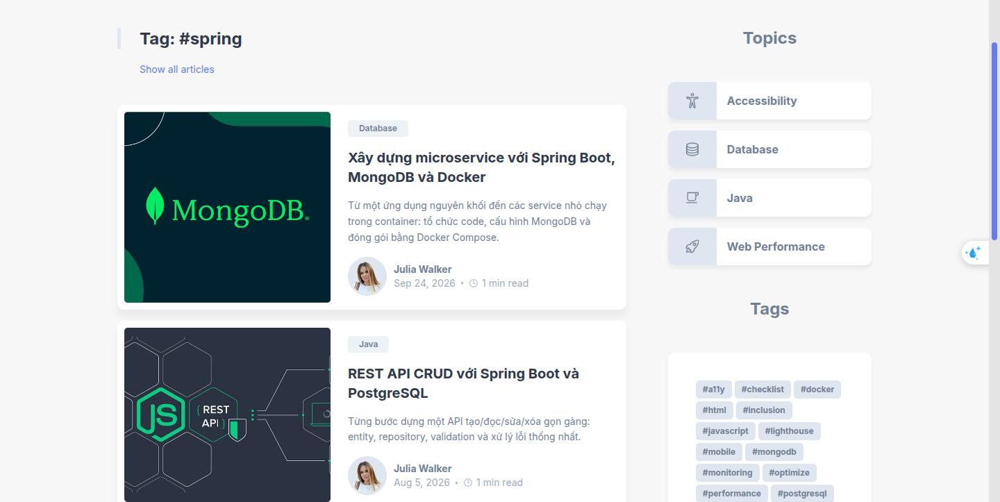 |

`/category/{slug}` and `/tag/{slug}` reuse the home layout with a heading ("Topic: Web Performance", "Tag: #spring") and a **Show all articles** link. The active topic is highlighted in the sidebar. Slugs are built from the free-text names, so "Web Performance" becomes `web-performance`. A category or tag that no published article uses returns 404.

#### Article

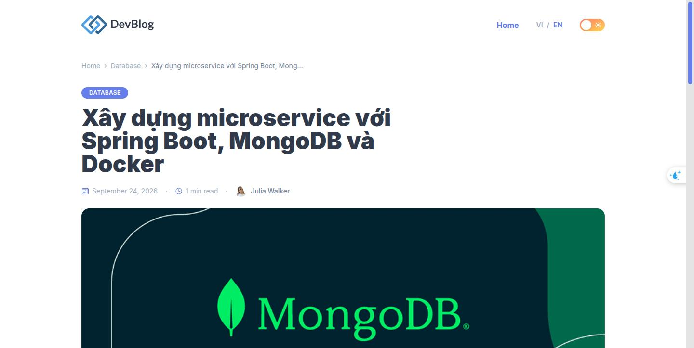

`/articles/{slug}` shows a breadcrumb (Home › category › title), the category badge, the title, and a meta line (full publication date, reading time, author), followed by the cover image.

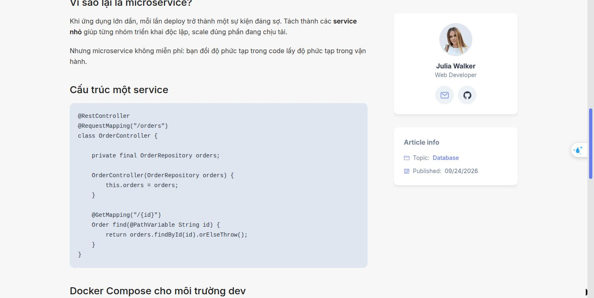

The body is Markdown rendered with Flexmark (headings, emphasis, lists, tables, fenced code blocks) and styled with Tailwind Typography. The HTML is sanitized with a jsoup allowlist before it reaches the template. An aside shows an author card with contact links and an **Article info** box (topic and publication date).

#### Not found

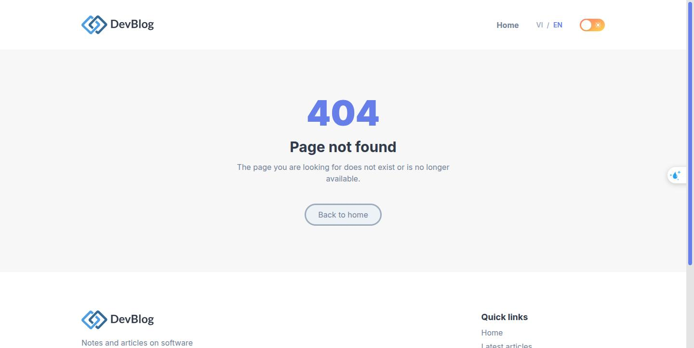

Unknown URLs, malformed ids or slugs, and **drafts or scheduled articles requested by a guest** all return the same 404 page. The admin can still see those articles, so a guest cannot tell whether an unpublished article exists.

### Admin section

#### Login

| Login | Wrong credentials |
|---|---|
| 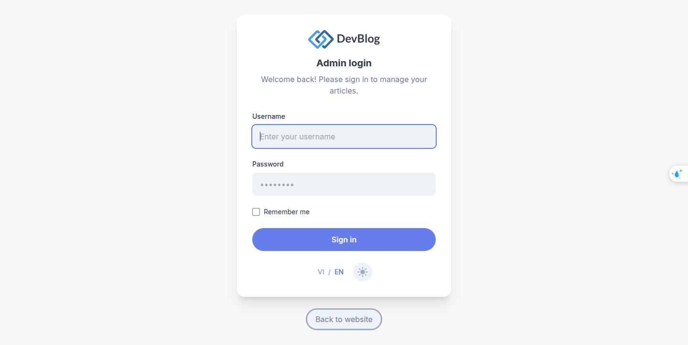 | 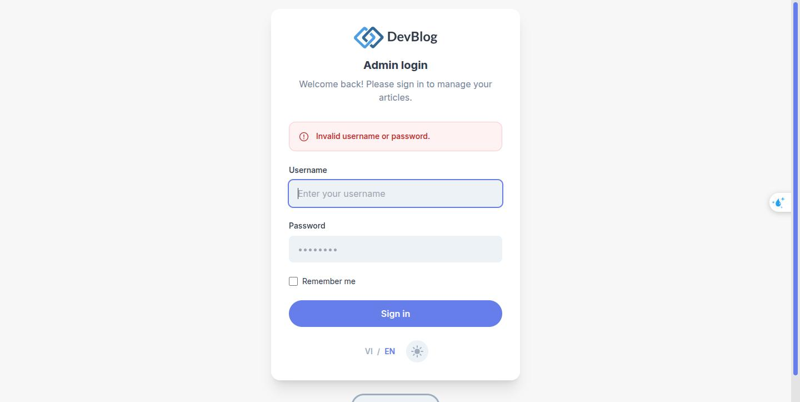 |

`/login` is a Spring Security form login with a **Remember me** option, the language switch and the theme toggle. A wrong username or password returns to the form with a generic error message. There is a single admin account, configured with `ADMIN_USERNAME` and a BCrypt `ADMIN_PASSWORD_HASH`. Everything under `/admin/**` requires `ROLE_ADMIN`, and every form carries a CSRF token.

#### Dashboard

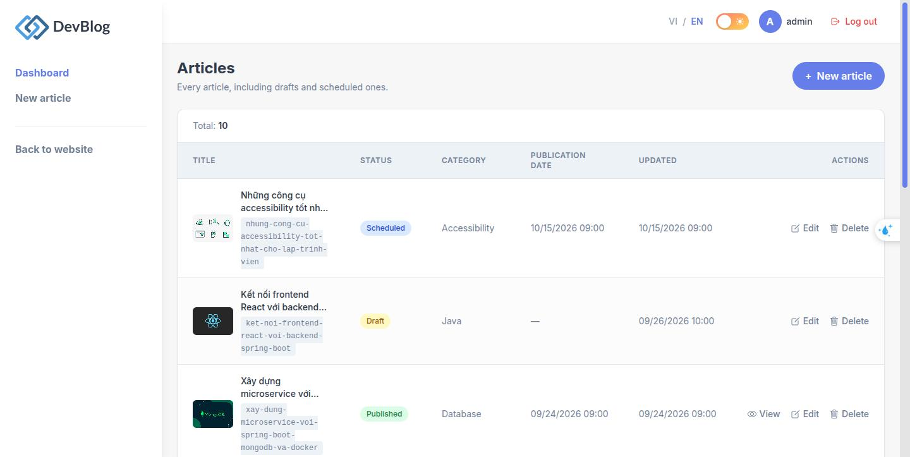

`/admin` lists **every** article, including drafts and scheduled ones, most recently updated first, 10 per page. Each row shows:

* a cover thumbnail, the title and the slug
* a status badge: **Published**, **Scheduled** or **Draft**
* the category, the publication date and the last update

Every row has **Edit** and **Delete** actions. Published articles also get **View**, which opens the public page. The status comes from `ArticleService`, not from the template.

#### Add article

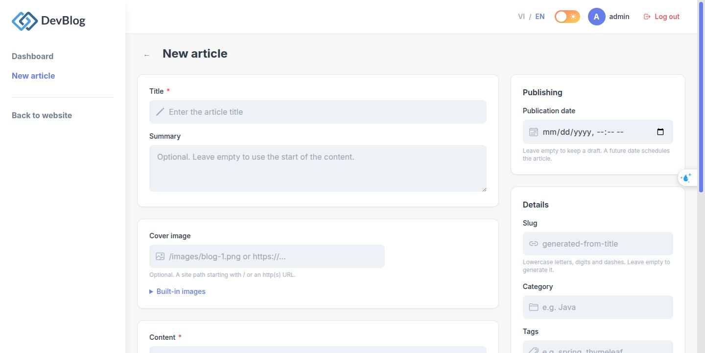

`/admin/articles/new` is a two-column form:

* **Main column**: title (required), optional summary, optional cover image (a `/path` or an `http(s)://` URL, with a list of built-in images), and the Markdown content (required).
* **Side column**:
  * **Publishing**: the publication date (`datetime-local`). Empty keeps a draft, a future date schedules the article.
  * **Details**: slug, category, and comma-separated tags. An empty slug is generated from the title, with Vietnamese diacritics removed.

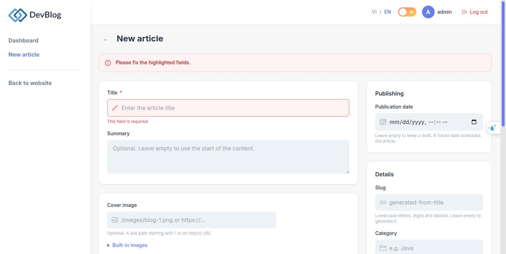

The server runs Bean Validation in group sequences and re-renders the form with a summary banner and per-field errors. Duplicate titles or slugs are reported on the matching field.

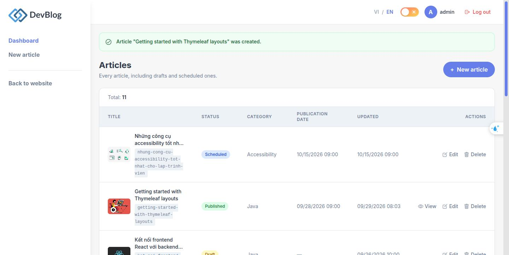

After a successful save, the app redirects to the dashboard with a flash message. The new article appears in the list, and the total goes from 10 to 11.

#### Edit article

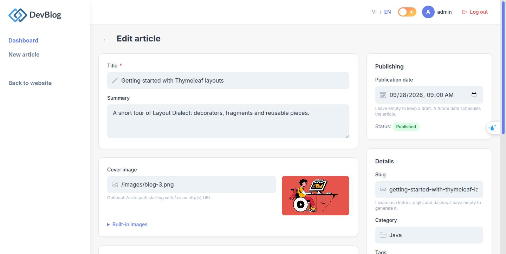

`/admin/articles/{id}/edit` uses the same form, pre-filled. It also shows the current status badge and a preview of the cover image.

#### Delete article

| Confirmation | After deleting |
|---|---|
| 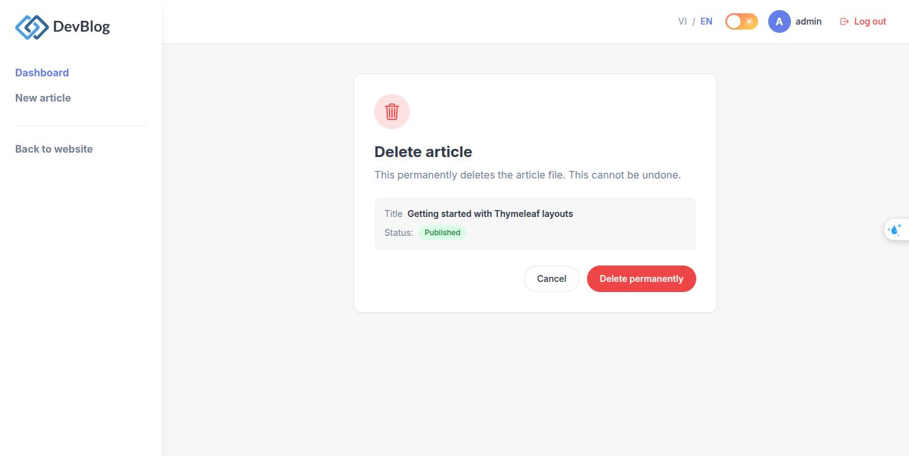 | 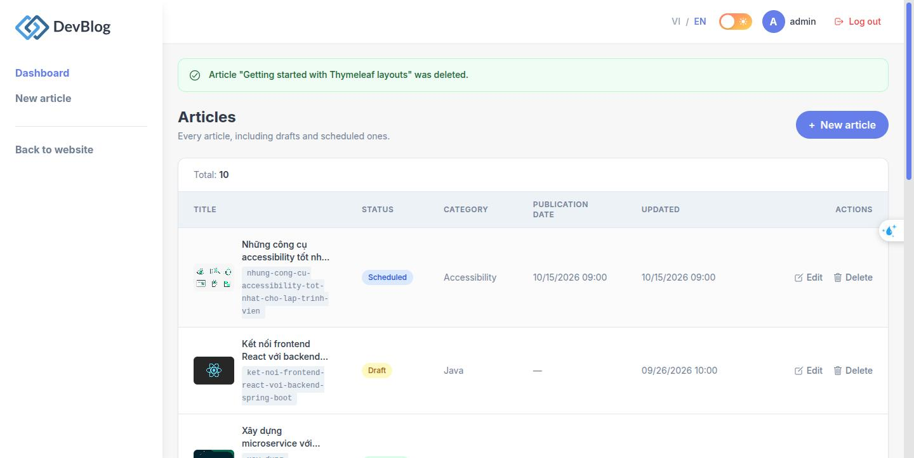 |

Deleting always goes through a confirmation page (`GET /admin/articles/{id}/delete`). It shows the title and status and warns that the file is removed permanently. **Delete permanently** posts the form, and the dashboard confirms with a flash message. No JavaScript `confirm()` dialog is involved.

### Dark mode and languages

| Dark mode (guest) | Dark mode (article) |
|---|---|
| 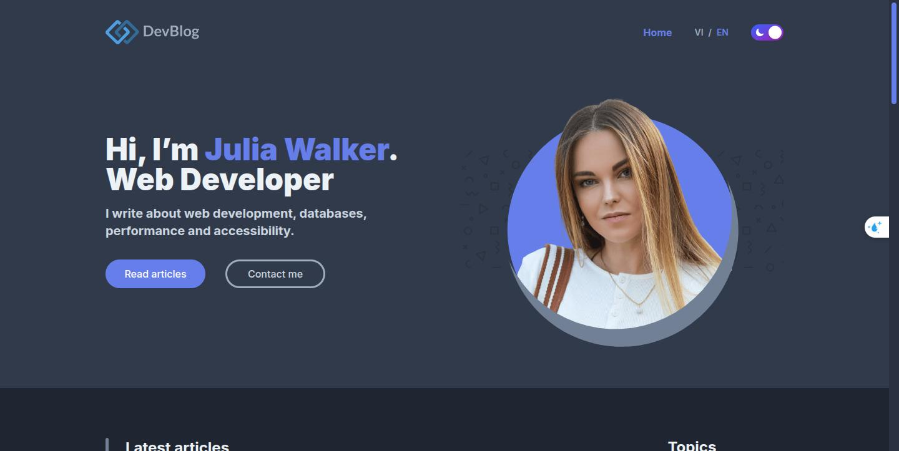 | 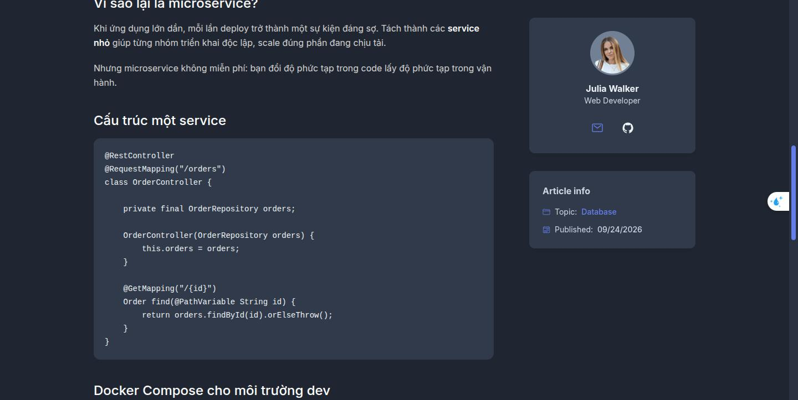 |

| Dark mode (admin) | Vietnamese |
|---|---|
| 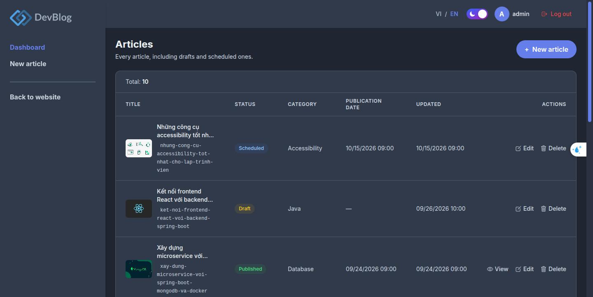 | 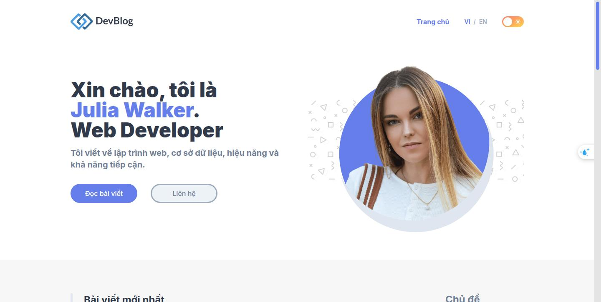 |

The theme toggle switches a `dark` class on `<html>`. The choice is kept in `localStorage` and applied before the first paint, and the default follows the operating system. Every element has light and dark variants built from the same color tokens.

The language switch (`?lang=vi`, `?lang=en`) is stored in a cookie. Every piece of UI text comes from `messages.properties` / `messages_vi.properties`, including validation messages, flash messages and date formats. Article content is shown as written.

### Mobile

| Home | Menu | Cards | Admin |
|---|---|---|---|
| 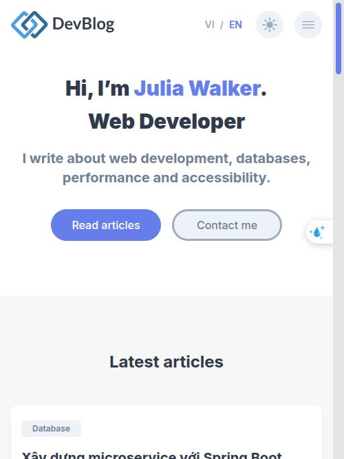 | 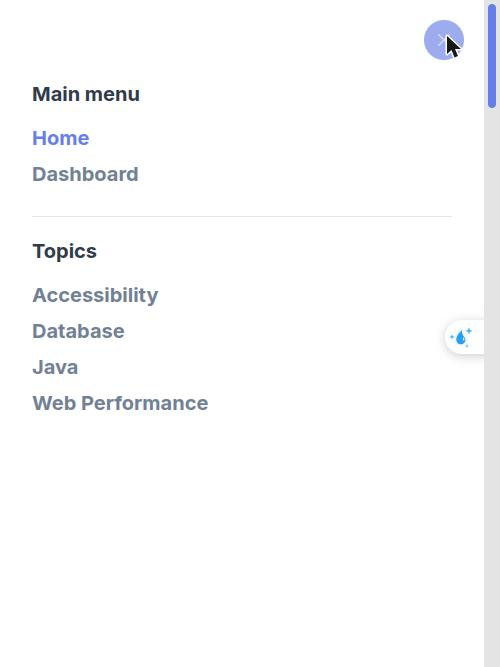 | 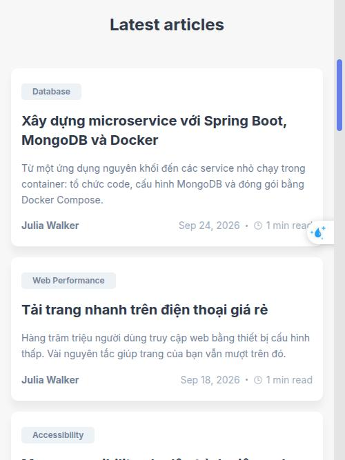 | 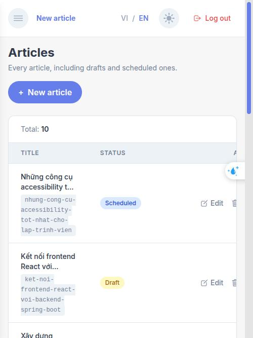 |

The layout is mobile-first:

* On small screens the hero stacks, the portrait is hidden, and cards drop their cover image.
* The navigation moves into a slide-in menu with the main links and the topics.
* In the admin, the header keeps visible links, so it still works without JavaScript. The article table scrolls horizontally.

## Features in detail

* **Publication rules** (in `ArticleService`, never in templates):
  * an empty publication date means a **draft**
  * a date in the future means **scheduled**
  * a date now or in the past means **published**

  Guests only ever see published articles, so a scheduled article appears on its own once its date passes.
* **Slugs**: generated from the title (Vietnamese diacritics and `đ` stripped, ASCII only) or entered by hand. Titles and slugs are unique, compared case-insensitively.
* **Categories and tags**: free text stored in the article file. Their URL segments are slugs, and names that differ only in case are merged.
* **Cover images**: only site-relative paths (`/images/...`) or `http(s)://` URLs are accepted. Other schemes such as `javascript:` or `data:` are rejected.
* **Safe Markdown**: the HTML from Flexmark is sanitized by jsoup. It is the only content printed with `th:utext`.
* **Storage**:
  * writes go to a temp file first and are then moved into place atomically, so a file is never half-written
  * a read/write lock guards the in-memory index
  * a malformed file is logged and skipped instead of crashing the app
  * YAML is parsed with SnakeYAML's `SafeConstructor`
* **Security**:
  * form login with session and remember-me
  * CSRF protection on every form
  * a BCrypt password hash only, never a plain password
  * the app refuses to start without admin configuration

## Tech stack

Java 17, Spring Boot 3.5, Spring MVC, Spring Security, Thymeleaf + Layout Dialect, Bean Validation, SnakeYAML, Flexmark + jsoup (sanitized Markdown), Tailwind CSS 3 (+ Typography), PostCSS, npm scripts.

## Project structure

```text
src/main/java/com/juliawalker/personalblog/
├── article/          Article domain, ArticleStore, FileSystemArticleStore, ArticleFileFormat, ArticleService
│   └── web/          Client and admin controllers, form data, converters
└── infrastructure/   Security, web helpers, exceptions, validation groups, Markdown rendering
src/main/resources/
├── i18n/             messages.properties, messages_vi.properties
├── static/           CSS source, js/script.js (dark mode / mobile menu), SVG, images
└── templates/        client/, admin/, shared/fragments/, error/
demo/articles/        10 sample articles
docs/screenshots/     screenshots used in this README
```

## Article storage

Each article is one file, `${ARTICLES_DIR}/{id}.md`:

```text
---
id: 7f3c0b9e-1d2a-4c3b-9f8e-0a1b2c3d4e5f
title: Hello world
slug: hello-world
summary: Optional short description
coverImage: /images/blog-1.png   # optional: a /path or an http(s) URL
category: Java
tags: [spring, thymeleaf]
publishedAt: 2026-09-28T10:00   # empty = draft
createdAt: 2026-09-20T08:00
updatedAt: 2026-09-28T10:00
---
Markdown body...
```

Back up the `ARTICLES_DIR` directory: it is the only data store.

## Configuration

| Variable | Purpose |
|---|---|
| `ARTICLES_DIR` | Article directory (default `./data/articles`) |
| `ADMIN_USERNAME` | Admin login name |
| `ADMIN_PASSWORD_HASH` | BCrypt hash of the admin password (never the plain password) |
| `SITE_NAME`, `SITE_DESCRIPTION`, `SITE_AUTHOR` | Site identity shown in the layout |
| `SITE_AUTHOR_ROLE`, `SITE_TAGLINE` | Hero text ("Web Developer", one-line tagline) |
| `SITE_HERO_IMAGE`, `SITE_AUTHOR_AVATAR` | Hero portrait and author avatar (default `/images/hero.png`, `/images/author.png`) |
| `SITE_EMAIL`, `SOCIAL_GITHUB`, `SOCIAL_FACEBOOK`, `SOCIAL_LINKEDIN`, `SOCIAL_X` | Contact links in the sidebar and footer (blank = hidden) |
| `REMEMBER_ME_KEY` | Remember-me signing key |
| `SESSION_COOKIE_SECURE` | `true` behind HTTPS, `false` for `http://localhost` |

The app refuses to start without `ADMIN_USERNAME` and a valid `ADMIN_PASSWORD_HASH`. For local development, copy `.env.example` to `.env` (not committed) and fill it in.

To create a BCrypt hash, for example: `python3 -c "import bcrypt; print(bcrypt.hashpw(b'your-password', bcrypt.gensalt()).decode())"` (needs the `bcrypt` package), or `htpasswd -bnBC 10 "" 'your-password' | tr -d ':\n'`.

## Running locally

```bash
cp .env.example .env     # then set ADMIN_PASSWORD_HASH
npm install
npm run build            # compile CSS/JS/templates into target/classes
mvn spring-boot:run      # http://localhost:8080, admin at /login
npm run watch            # optional: live reload on http://localhost:3000
```

### Demo data

`demo/articles/` holds 10 sample articles (8 published, 1 scheduled, 1 draft) with cover images. Run against a copy so the demo files stay untouched:

```bash
cp -r demo/articles /tmp/blog-demo
ARTICLES_DIR=/tmp/blog-demo mvn spring-boot:run
```

With Docker:

```bash
docker build -t personal-blog .
docker run -p 8080:8080 --env-file .env -v "$PWD/data/articles:/data/articles" personal-blog
```

Only run one instance, because the article index lives in memory.

## Build and test

```bash
mvn test                 # no database or Docker needed
mvn -P release package   # production frontend build
```

See `ROADMAP.md` for the development plan and `CLAUDE.md` for coding conventions.
